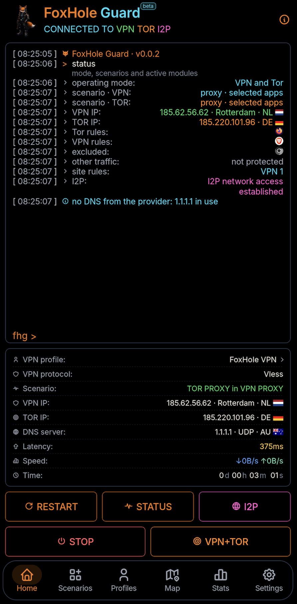
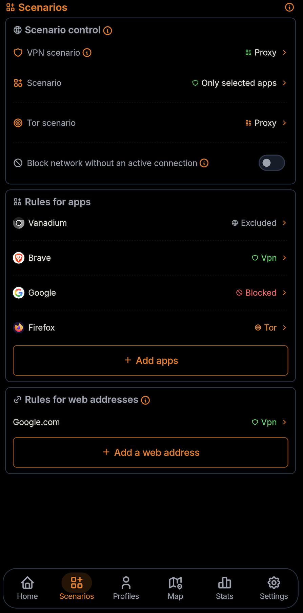
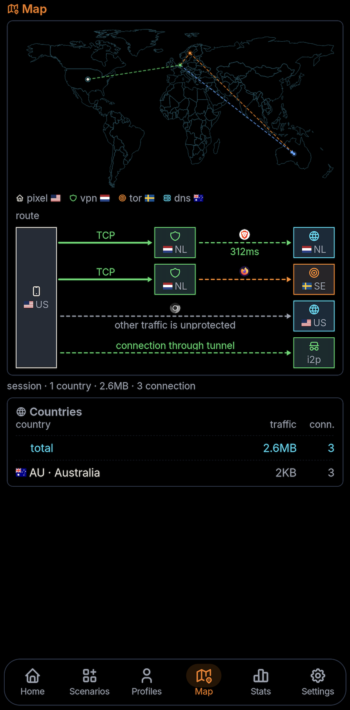
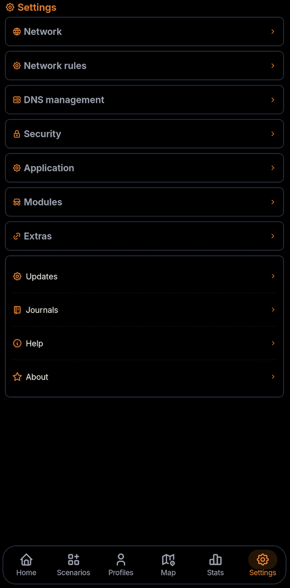

<p align="center">
    
</p>

<p align="center">
  <a href="README.md">
    
  </a><a href="docs/README.ru.md">
    
  </a>
</p>

<p align="center">
  <a href="https://github.com/foxhole-team/foxhole-guard/releases">
    
  </a>
  <a href="https://f-droid.org/packages/com.foxhole.guard/">
    
  </a>
</p>

# FoxHole Guard


[](https://www.gnu.org/licenses/gpl-3.0.html)


**FoxHole Guard** is a network protection, privacy, and local network activity control suite for Android.

The application combines its own native **FoxHole Core written in Rust**, VPN, Tor, I2P, a local firewall, DNS filtering, network activity monitoring, web apps, and a proxy server.

The core idea of the project is a single application for everyday network protection, access to VPN and the Tor and I2P anonymity networks, application traffic routing, local detection of unusual network activity, and unauthorized application installations. FoxHole Guard maintains logs containing system events, application installations and removals, and network traffic anomalies.

**FoxHole Guard** contains no advertising, usage analytics, or telemetry. Application lists, statistics, logs, routing rules, and local analysis results remain on the device unless the user explicitly exports them.

> [!IMPORTANT]
> The current public beta is **0.0.2**. The project is still under active development and production testing. FoxHole Sentinel analysis and its notifications are disabled by default and run only after the user enables the module. Part of the code and documentation was created with AI assistance.

<p align="center">
  
  
  
  
</p>

---

## ✨ Key features

- **FoxHole Core** - a custom network core written in Rust.
- **VPN protocol support** - VLESS, VMess, Hysteria2, WireGuard, AmneziaWG, Trojan, Shadowsocks, Naive, TUIC, and AnyTLS.
- **Tor access** - connection to Tor inside a TCP VPN tunnel, routing for selected applications, bridge support, and automatic scheduled Tor circuit rotation.
- **I2P access** - access to `.i2p` resources through a separate `i2pd` process and a local SOCKS5 contract with FoxHole Core.
- **Firewall** - application blocking, kill switch, and quarantine for newly installed applications.
- **DNS management** - local DNS interceptor, UDP/TCP/DoT/DoH, cache, and stale cache.
- **Traffic map** - displays current device network connections on a world map.
- **FoxHole Sentinel** - optional local IOC and network-anomaly analysis, disabled by default.
- **Web apps** - support for HTML5 applications and notification delivery.
- **Proxy server** - a local-network proxy server with SOCKS5 and HTTP CONNECT support and authentication.
- **Background services** - `foxhole watchdog web` and `foxhole watchdog guard` for web-app notification delivery and background security-event monitoring.
- **Security** - mechanisms for detecting signs of compromise and interference: application installation/removal logging, network anomaly analysis, and checks of newly installed applications against threat indicators and requested permissions. Custom encryption of application data is supported.

---

## 🧭 Architecture and operating model

### 🔁 Application control flow

```text
application
        ↓
operating mode  →  scenario  →  traffic routing rules
        ↓
modules  ·  extensions  ·  background services
```

- **Operating mode** determines which connection - VPN and/or Tor - uses the Android system VPN tunnel.
- **Scenario** determines how VPN and the Tor route are applied to the device.
- **Rules** determine how applications and websites use routes through VPN and Tor.
- **Modules and extensions** operate alongside any active application mode.
- **Background services**, when enabled, run continuously within Android platform restrictions.

### 🎛️ Operating modes

The application supports three primary modes:

| Mode | Description |
| --- | --- |
| **VPN** | Standard VPN tunnel. |
| **Tor** | Connection to the Tor network through Arti. A VPN profile is not required; the Tor module must be enabled. |
| **VPN and Tor** | Both connections run simultaneously, each with its own scenario. |

### 🧩 Mode scenarios

The application mode is controlled by a scenario. In **VPN and Tor** mode, VPN and Tor use independent scenarios.

| Scenario | Meaning | Available for |
| --- | --- | --- |
| **Entire device** | All device traffic goes through the tunnel. | VPN, Tor |
| **Proxy scenario: selected applications** | Only selected applications are routed. | VPN, Tor |
| **Proxy scenario: all except selected** | Everything except selected applications is routed. | VPN |
| **Proxy server** | Android proxy server through the active connection on the device. | VPN |
| **Proxy server on local network** | Creates a proxy server on the local network through the active connection on the device. | VPN, Tor, Mixed |

Restrictions apply to routing all device traffic through Tor alongside an active VPN connection. If Tor is started outside the VPN tunnel while VPN is active, the selected-applications scenario is used. In Mixed mode for the local-network proxy server, SOCKS5 traffic is routed through VPN, while HTTP CONNECT traffic is routed through Tor.

### 🔀 Traffic routing rules

Traffic routing rules are applied within the active mode and scenario:

- per-application rules control traffic routing between VPN and Tor;
- **block internet access** and **exclude from DNS filtering** rules remain active in any of the three operating modes when the firewall module is enabled;
- website rules support domain names, suffixes, and CIDR ranges;
- separate DNS policies are supported;
- traffic blocking on connection loss, quarantine for newly installed applications, and TTL rules are supported.

| Rule | Entire device | Proxy scenarios |
| --- | --- | --- |
| application → VPN | not applied | applied |
| application → Tor | not applied | applied |
| application → exclude | applied | applied |
| application → block | applied | applied |
| web-address rules | applied | applied |

The **Entire device** scenario ignores traffic routing rules except block and exclude rules. If the system tunnel or firewall is not running, the block rule is not applied.

All traffic routing rules are applied atomically. Changes to application-mode scenarios are also applied atomically by default; this behavior can be disabled in settings.

---

## 🧱 Modules

Modules are configured separately from the application mode and can operate independently when their functions do not require an active network route.

| Module | Description |
| --- | --- |
| **Traffic map** | Displays current network connections on a world map. |
| **Statistics** | Local accounting by application, VPN profile, and DNS filtering. |
| **Logs** | Application log, network log, and security log. |
| **Firewall** | Application blocking and quarantine for newly installed applications. |
| **Tor** | Arti: TCP, `.onion`, bridges, and scheduled Tor circuit rotation. |
| **I2P** | `.i2p` through a separate `i2pd` process and loopback SOCKS5. |
| **FoxHole Sentinel** | Application auditing, IOC matching, and a log with hash-chain integrity verification. |
| **DNS** | DoT/DoH and local filtering. |

### 🧅 Tor access

Tor access is implemented through **Arti**.

Supported:

- connection to the Tor network inside a TCP VPN protocol;
- bridges;
- network-access blocking when the connection is lost;
- Tor circuit rotation at a configured time interval;
- routing for selected applications.

The Tor module is included in the standard Android build of FoxHole Core.

#### 🌐 Onion service

FoxHole Core supports onion services.

### 🕸️ I2P access

I2P access is not implemented inside FoxHole Core.

A TCP-only loopback SOCKS5 contract with a separate `i2pd` process is used.

I2P route conditions are checked fail-closed:

- interception of `.i2p` links from any application;
- traffic relay mode into the I2P network;
- cellular-network usage restrictions;
- bandwidth management.

### 🧱 Firewall

The firewall uses the shared FoxHole Core route policy.

Supported:

- application blocking;
- `Block` taking precedence over allow routes;
- per-app rules;
- network quarantine;
- TTL rules;
- kill switch;
- immediate targeted revocation of active stream-proxy flows after a deny rule is introduced; packet-tunnel L3 flows re-evaluate after their idle timeout;
- typed failures on invalid reloads.

### 🛡️ FoxHole Sentinel

FoxHole Sentinel is FoxHole Guard's optional local security-monitoring module. It is disabled by default; when enabled, its background work runs in the `foxhole watchdog guard` service.

FoxHole Sentinel is designed to combine several independent signal sources: indicators of compromise, network activity, static application analysis, and behavioral indicators. Analysis results are processed locally and are not sent to the developer.

FoxHole Sentinel is not positioned as an antivirus product. Its purpose is to show the user observable indicators, their sources, and confidence levels, while separating confirmed IOC matches from heuristic suspicions.

#### ✅ Implemented

At the current stage, FoxHole Sentinel includes:

- **Echap Stalkerware Indicators** - local checking against known stalkerware indicators;
- **network IOC matcher** - application network activity from the live FoxHole Core event stream is matched against known domains and IP addresses; enabled with the FoxHole Sentinel analysis toggle;
- local correlation of detected IOCs with the application that owns the network flow;
- integration with the FoxHole Guard firewall and quarantine;
- core-event auditing through a bounded FoxHole Core event stream.

An IOC match is a security signal, but is not treated by itself as conclusive evidence that the device is compromised.

FoxHole Core does not maintain a persistent user Guard log. The core exposes a bounded event stream to the application, while the Android application maintains the long-term log. If the consumer cannot keep up with the stream, the audit interface explicitly reports `dropped` events.

#### 🧪 Planned

The FoxHole Sentinel architecture is designed for further expansion of local analysis. The following capabilities are **not yet implemented and are not part of the current version**:

- YARA-X for local analysis of APK, DEX, and native libraries;
- detection of packer, obfuscation, and anti-analysis indicators;
- behavioral analysis of DEX and Android API sequences;
- correlation with MITRE ATT&CK Mobile;
- advanced analysis of application network behavior;
- detection of beacon-like activity;
- analysis of unusual TX/RX patterns;
- DGA-like DNS indicators;
- per-app baselines that account for Wi-Fi/mobile and foreground/background state;
- a correlation engine combining static, IOC, Android, and network evidence into a single finding.

These capabilities are planned as local detectors without cloud scanning and without sending APKs, the installed-application list, or network activity history.

#### 📜 Security log

The application can maintain an encrypted local log containing:

- application installations;
- updates;
- removals;
- security events;
- selected network events.

A hash chain is used for integrity verification.

---

## 🔌 Supported protocols

| Protocol / mode | Support |
| --- | --- |
| **VLESS** | raw, WebSocket, HTTP Upgrade, gRPC/HTTP-2, TLS, Reality, Vision, UDP-over-stream, XUDP, packetaddr |
| **VMess** | modern AEAD (`alterId=0`), raw, WebSocket, TLS, TCP/UDP |
| **Hysteria2** | QUIC/H3, auth, Brutal, TCP/UDP, Salamander obfs, destination-port hopping on one protected local UDP socket, reconnect |
| **WireGuard** | custom Noise_IKpsk2 handshake, L3 data path, `reserved`, import of `wg://` and `.conf` |
| **AmneziaWG** | `Jc/Jmin/Jmax/S1..S4/H1..H4`, 2.0 templates `I1..I5` |
| **Trojan** | TLS, TCP and UDP framing |
| **Shadowsocks** | AEAD and AEAD-2022, TCP/UDP |
| **Outline** | Shadowsocks variant, not a separate protocol |
| **Naive** | native HTTP/2 CONNECT with protocol padding |
| **TUIC** | clean-room v5, QUIC, TLS-exporter auth, TCP/UDP, fragmentation, reconnect |
| **AnyTLS** | clean-room v2, TLS auth, padding, session reuse/multiplex, TCP and UoT v2 UDP |
| **SOCKS5** | CONNECT, UDP ASSOCIATE, authentication |
| **HTTP proxy** | HTTP CONNECT, authentication |
| **Tor** | Arti, TCP, `.onion`, bridges |
| **I2P** | TCP-only loopback SOCKS5 adapter to a separate `i2pd` process |

### ↔️ Shadowsocks and Outline

Outline is treated as a Shadowsocks variant.

Supported:

- AEAD;
- AEAD-2022;
- Outline `prefix=` for compatible AEAD configurations;
- SIP003 `v2ray-plugin` in WebSocket mode;
- `simple-obfs` in `http` and `tls` modes.

`v2ray-plugin` and `simple-obfs` are transports, not separate VPN protocols.

### 🚫 Not supported

**ShadowsocksR (SSR)** is deprecated and unsupported.

---

## 🌐 DNS

### 🧭 DNS management

FoxHole Core contains its own DNS interceptor.

Supported:

- UDP DNS;
- TCP DNS;
- DoT;
- DoH;
- protected DNS sockets;
- DNS bootstrap through a specific Android `Network`;
- cache;
- stale cache;
- fake-IP;
- route-aware DNS.

### 🧹 DNS filtering

FoxHole Guard can apply local rule sets for:

- advertising;
- trackers;
- telemetry;
- potentially malicious domains.

The ruleset is built from the open AdGuard DNS filter. The upstream is pinned by name; feeds built from any other source are rejected.

Manifest:

```text
https://foxhole-team.github.io/foxhole-db/manifest.json
```

Downloaded DNS rulesets are **filtering data, not executable code**.

Before use, the application validates format-defined parameters including signature, size, compatibility, and SHA-256.

If validation fails, an installed verified ruleset is kept. On a fresh install, DNS filtering remains unavailable until a ruleset passes verification.

---

## 🔐 TLS and protected sockets

FoxHole Core uses a Rust TLS stack with certificate validation.

Supported:

- WebPKI validation;
- SNI;
- ALPN;
- SPKI SHA-256 pin;
- `insecure` compatibility mode.

`insecure` is not a secure default and requires explicit user consent.

Every outbound Android socket created by FoxHole Core follows:

```text
protect(fd)
    ↓
bind to Android Network
    ↓
connect / send
```

---

## 🧩 Extensions and additional capabilities

Extensions add capabilities to the core application.

| Extension | Description |
| --- | --- |
| **Proxy server** | Exposes access to other devices on the current Wi-Fi network through SOCKS5 and HTTP CONNECT with mandatory authentication and binding to a confirmed network. |
| **Web apps** | HTML5 sites in a full-screen frame; each runs in an isolated WebView profile with notification support. |

### 🔗 Proxy server

The proxy server shares the active route with other devices on the current Wi-Fi network.

- SOCKS5 and HTTP CONNECT;
- mandatory authentication;
- changing networks disables the proxy server and invalidates credentials.

Routing presets: VPN, Tor, Mixed - SOCKS5 through VPN, HTTP CONNECT through Tor.

### 🖥️ Web apps

A separate ASCII identifier is created for each web app and used by FoxHole Core in network traffic routing policy.

- web-app identity: per-app storage isolation; on supported WebView versions, each web app runs in a separate profile with its own cookies, storage, and cache; without multi-profile support, a shared WebView profile is used with browser origin isolation;
- separate routable leases;
- network rules at the web-app level;
- notifications bound to the canonical origin identity;
- revocation of a granted lease.

Web-app data - cookies, storage, and cache - can be cleared separately for each added web app. Removing a web app completely also removes its data.

#### 🔔 Web-app background service - `foxhole watchdog web`

Web-app notifications are delivered by a separate background service.

**Polling model.** The service polls enabled web apps on a schedule through a hidden WebView: it injects a JS shim into the page and reads the site's counter when available, otherwise `(N)` from the tab title. Delivery is periodic rather than real-time; the interval is configured in settings. The schedule is driven by an in-process ticker and a WorkManager pass every 15 minutes as a fallback if the process is terminated. Concurrent passes are coalesced; images are not loaded during polling.

**Polling conditions.** An application is not polled if:

- its route is unavailable: a VPN route requires an active VPN connection and an available local proxy bridge; WireGuard and AmneziaWG are not used for this polling because they do not provide a local proxy bridge; Tor requires an active Tor circuit; I2P requires an active I2P connection; the `BLOCK` route always forbids polling;
- the WebView proxy override is not installed: the override is process-global and validated fail-closed; only a loopback host with an available port and both credential values is accepted, otherwise the override is not applied.

**After polling.** The override is removed and removal is verified. Service-worker networking is blocked until the route changes so a background page worker cannot access the network outside the new override. A foreground frame takes exclusive ownership of the override: while it owns the override, background passes do not start, and if ownership cannot be obtained, the frame does not open. The frame never operates outside its assigned route.

## ⚙️ Background services

FoxHole Guard uses two independent background services.

| Service | Function |
| --- | --- |
| **`foxhole watchdog web`** | Checks and delivers notifications for added web apps. |
| **`foxhole watchdog guard`** | Monitors events and records application installations/removals and network traffic anomalies in the protected log. |

In hardened mode, `foxhole watchdog guard` creates a foreground service so it remains in memory when there is no active network connection, and stops after an active connection is detected. Power-saving mode uses periodic WorkManager polling.

---

## 🗃️ FoxHole DB and datasets

[](https://github.com/foxhole-team/foxhole-db)

FoxHole DB contains five independent signed datasets downloaded by the application as their features need them. The TLS feed carries tables only: ClientHello generation remains compiled into FoxHole Core, and a failed update leaves the built-in or last verified tables in use.

| Dataset | Artifact | Format | Source | License | Version |
| --- | --- | --- | --- | --- | --- |
| **DNS - filtering lists** | `adguard-dns-filter.fhds` | `foxhole-dns-fst-v1` | [AdGuard DNS filter](https://github.com/AdguardTeam/AdGuardSDNSFilter) | GPL-3.0 | The upstream commit is pinned for each build. |
| **Tor - mirror of built-in bridges** | `bridges.json` | `tor-bridges-json` | [Tor Project built-in bridges (Moat)](https://bridges.torproject.org/moat/circumvention/builtin) | public censorship-circumvention data | `generated_at` marker; object keys are normalized, while upstream array order is preserved. |
| **FoxHole Sentinel - security lists (threat intelligence)** | `threat-intel.json` | `sentinel-threat-intel-json`, document `schema: 3` | [AssoEchap/stalkerware-indicators](https://github.com/AssoEchap/stalkerware-indicators) | CC-BY-4.0 | The upstream commit is pinned for each build and recorded in `threat-intel-source-info.json`. |
| **Geo database - IP → country** | `dbip-country-ipv4.csv`, `dbip-country-ipv6.csv` | `dbip-country-csv` | [DB-IP Lite via sapics/ip-location-db](https://github.com/sapics/ip-location-db) (`dbip-country`) | CC-BY-4.0 | Upstream `version` from the dataset's `package.json` is copied into the manifest. |
| **TLS fingerprint tables - ClientHello profiles** | `fingerprints.json` | `tls-fingerprint-tables-json` | [FoxHole Core `fingerprints/`](https://github.com/foxhole-team/foxhole-core) | GPL-3.0-or-later | The upstream revision is pinned for each build; every profile re-derives its own `fingerprint_sha256` before it is applied. |

---

## 🔒 Permissions and privacy

- `INTERNET` - VPN, proxy, Tor, I2P, DNS, web apps, subscriptions, and updatable network data.
- `ACCESS_NETWORK_STATE` / `ACCESS_WIFI_STATE` - network state, network rules, and proxy server.
- `FOREGROUND_SERVICE` and corresponding foreground-service permissions - long-running user-controlled network modes with a visible notification.
- `QUERY_ALL_PACKAGES` - application list for split routing, firewall, quarantine, DNS exclusions, and local auditing.
- `PACKAGE_USAGE_STATS` - only for user-enabled local statistics and analysis features that require the corresponding Android system access.
- `CAMERA` - QR import.
- `POST_NOTIFICATIONS` - network services, FoxHole Sentinel, and web-app notifications.
- `RECEIVE_BOOT_COMPLETED` - restoring the selected mode after reboot.
- `WAKE_LOCK` - maintaining network sessions where required.

The following data remains on the device:

- list of installed applications;
- local statistics;
- connections and logs;
- FoxHole Sentinel results;
- auto-connect history;
- DNS exclusions;
- firewall policy;
- route policy;
- local web-app data;
- module and extension settings;
- Vault metadata.

FoxHole Guard does not send this data to the developer.

### 🌍 Network requests

FoxHole Guard performs network requests only for enabled or user-initiated features:

- VPN;
- Tor;
- I2P;
- HTTPS subscription updates;
- connectivity checks;
- user-configured DNS;
- GeoIP/DNS/Tor bridge updates;
- web apps;
- event delivery for enabled web apps.

---

## 🤖 Android / Native ABI

FoxHole Core connects to Android through a versioned C/JNI ABI.

The Capabilities API reports the protocols and core capabilities actually compiled into the build.

The public beta APK ships one device-verified ABI: `arm64-v8a`.

`armeabi-v7a` and `x86_64` remain buildable development targets, but they are not
distributed until their live device/runtime matrices pass.

Native libraries are built using pinned Rust/NDK toolchains and pass ELF gates.

---

## 🔏 Release verification

For APKs from an official release, verifying the checksum and signing certificate is recommended.

```bash
sha256sum -c SHA256SUMS
```

```bash
apksigner verify --print-certs FoxHole-<tag>-<abi>-release.apk
```

Expected certificate SHA-256 fingerprint:

```text
e59de2486084c38f3c77e9df0eb5eff9a4559f3c68024f1208e0e9c04b0df665
```

Expected SHA-1 fingerprint:

```text
9e00dc6b54461a4647cb11133b394cdfc986646d
```

---

## 🔗 Related projects

[](https://github.com/foxhole-team/foxhole-core)
[](https://github.com/foxhole-team/foxhole-core/releases)

[](https://github.com/foxhole-team/foxhole-db)
[](https://github.com/foxhole-team/foxhole-db/releases)

---

## 📄 Licenses

FoxHole Guard and FoxHole Core are distributed under:

**GNU General Public License v3.0 or later (`GPL-3.0-or-later`)**

Copyright (C) 2026 FOXHOLE TEAM.

Third-party dependency licenses are listed in:

- `THIRD_PARTY_NOTICES.md`;
- the project SBOM (`*.cdx.json`).

The dependency and license graph is validated in CI.

---

## ❤️ Support

**XMR (Monero):**

```text
48yBVPTdcyJ1WoJtnKmVpEZziEsDy4HvbCW7eQDS9mfdiWPFXwZ8F5h9YZ2UTTBLxPcJgQgvth7iqLZM2yMCaQ432qaouqr
```

**BTC (Bitcoin):**

```text
bc1qatnyy7jcpqrp0d3dk9rta9vqfejgh4mysd6m2f
```

**ETH (Ethereum):**

```text
0xDEBA357Cc8f5E865ea7FFa98E138C8241A16A465
```

---

## ⚠️ Disclaimer

> Android application development is not our primary area of work. Our main areas of specialization are backend engineering, security, machine learning, and cryptography.

- Tor is a trademark of The Tor Project. FoxHole Guard is not a product of The Tor Project and is not endorsed, sponsored, or affiliated with The Tor Project.
- FoxHole Guard is not a product of AdGuard and is not affiliated with AdGuard Software Ltd.
- FoxHole Guard is not an official product of I2P or PurpleI2P.
