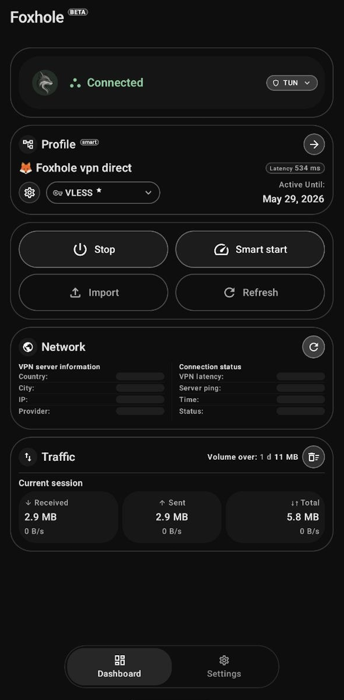
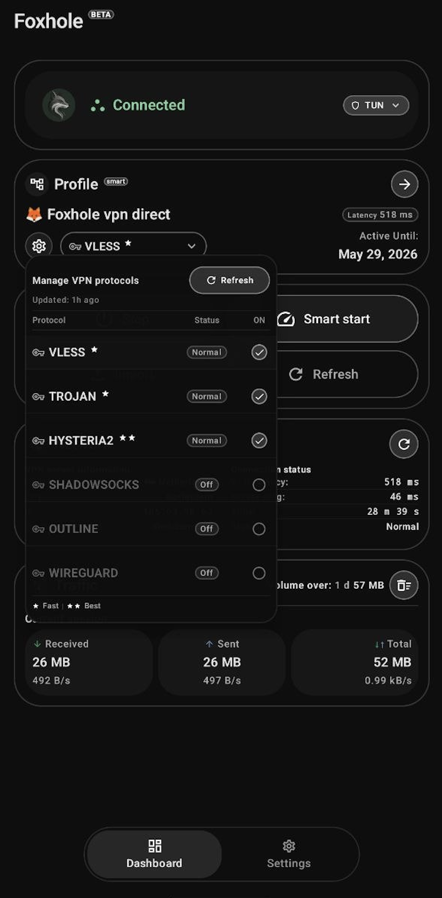
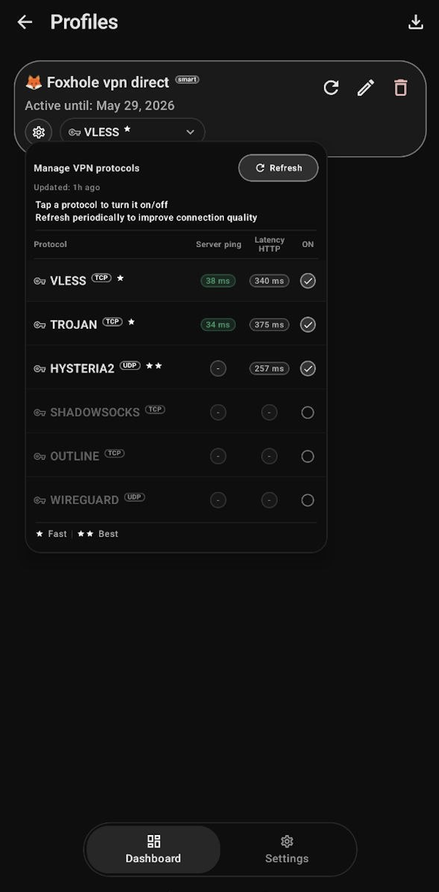

<p align="center">
  
</p>

<p align="center">
  <strong>English</strong> |
  <a href="README.ru.md">Русский</a>
</p>

<p align="center">
  <a href="https://f-droid.org/">
    
  </a>
<br><strong>Pending publication on F-Droid</strong>
</p>
<p align="center">
  <strong>Build version 1.0.0-beta1</strong><br>
  iOS, macOS, and Windows versions - maybe.
</p>

Foxhole is a simple Android client for connecting to and managing sing-box profiles.

It supports:

* Tunnel and Proxy modes
* Split Tunnel for apps and domains
* LAN Proxy

Profiles can be imported from files, clipboard, QR codes, and HTTPS subscriptions (including v2raytun-compatible formats).

>No ads. No analytics. No telemetry.


<p align="center">
  
  
  
</p>

## Key features

- Modes: Tunnel, Proxy
- Split Tunnel (apps + sites)
- LAN Proxy over Wi-Fi
- Proxy authentication
- Site-based routing rules
- Import: files, clipboard, QR, HTTPS subscriptions
- Smart start with deterministic auto protocol selection
- Local traffic statistics
- Subscription expiration tracking
- Encrypted local storage
- No ads / analytics / telemetry

>QUERY_ALL_PACKAGES is used only for the Split Tunnel app picker, so Foxhole can list installed apps for include/exclude routing. Package lists stay local.

## Foxhole smart config

<p align="center">
  
</p>

This configuration demonstrates how a single subscription can define multiple profiles, each containing several protocol variants.

Each profile (e.g. `profile_0`, `profile_1`) represents a logical route group:

* `profile_0` - direct connection
* `profile_1` - routed traffic (e.g. Tor/I2P path)

Inside each profile, multiple protocol options are provided:

* VLESS
* Trojan
* Hysteria2
* Shadowsocks 2022
* Outline
* WireGuard

All options within the same profile are functionally equivalent routes using different transport/protocol implementations.

WireGuard blocks are included as full configurations, while other protocols are provided as standard URI formats.

Additional metadata (e.g. `profile_1`, `profile_2`, expiration timestamps) can be embedded in comments or parameters and used for grouping or filtering.

This structure allows flexible routing setups while keeping all protocol options synchronized under the same logical profile.

##### Example:
[Foxhole smart config](foxhole-sample-smart-config/foxhole-smart-config.sample.txt)


### Smart start

Smart start automatically selects the best protocol for connection.

Instead of using a fixed configuration, the app:

* tries available protocol options
* ranks them based on past performance and current network conditions
* starts with the recommended protocol
* connects using the first successfully validated option

The process is sequential and limited:

* up to three candidates are tried during auto-connect
* the next option is only tried after a failure
* all candidates can be tested during manual metrics refresh

Over time, the system adapts:

* remembers successful connections (including per-network)
* avoids recently failing protocols (cooldown)
* takes last known good into account
* uses network-scoped memory for different environments

Ranking is based on:

* success and failure history
* DNS and network state
* latency and connection time
* signs of valid traffic
* cooldown and recent failures

The following options are automatically excluded:

* disabled options
* expired profiles
* protocols in cooldown
* insecure configurations without explicit consent

The process is fast and lightweight.
> No telemetry is transmitted - all decisions are made locally on the device.
The app does not send connection data, traffic information, configurations, or usage statistics to external servers.
Protocol selection, stability evaluation, and Smart start logic are performed entirely on-device without any external services.


## Verifying release signatures

- Download APK and `SHA256SUMS` from the same release
- Run: `sha256sum -c SHA256SUMS`

- SHA-256:
  ```
  fcbf14862040fbe26726f06f3016ec3b027d8431c76cb4c25c13c5a06837177c
  ```

- SHA-1:
  ```
  ae609bb369398071cc5ac53c9ac10f20f43c4d01
  ```

## To Do

> Current implementation uses sing-box as the main runtime backend for protocol handling.
In the long term, Foxhole will move toward a more controlled runtime architecture.
Planned work:
* Rewrite most VPN protocol logic in Rust
* Reduce dependency on sing-box
* Keep sing-box as a fallback backend for unsupported or legacy configurations
* First implement native support for selected protocols:
  * Shadowsocks
  * VLESS
  * Hysteria2
  * selected TCP-based transports
Improve runtime stability for both TCP and UDP protocols
Improve protocol validation, fallback logic, and connection state handling

## Disclaimer

> Android application development is not our primary focus.
> Our core focus is in backend systems, security, machine learning, and cryptography.

## Licenses

- Foxhole: GPL-3.0-or-later
- sing-box/libbox: GPL-3.0-or-later

## Donate

- **XMR (Monero):**
```
48yBVPTdcyJ1WoJtnKmVpEZziEsDy4HvbCW7eQDS9mfdiWPFXwZ8F5h9YZ2UTTBLxPcJgQgvth7iqLZM2yMCaQ432qaouqr
```
- **BTC (Bitcoin):**
 ```
bc1qatnyy7jcpqrp0d3dk9rta9vqfejgh4mysd6m2f
  ```
