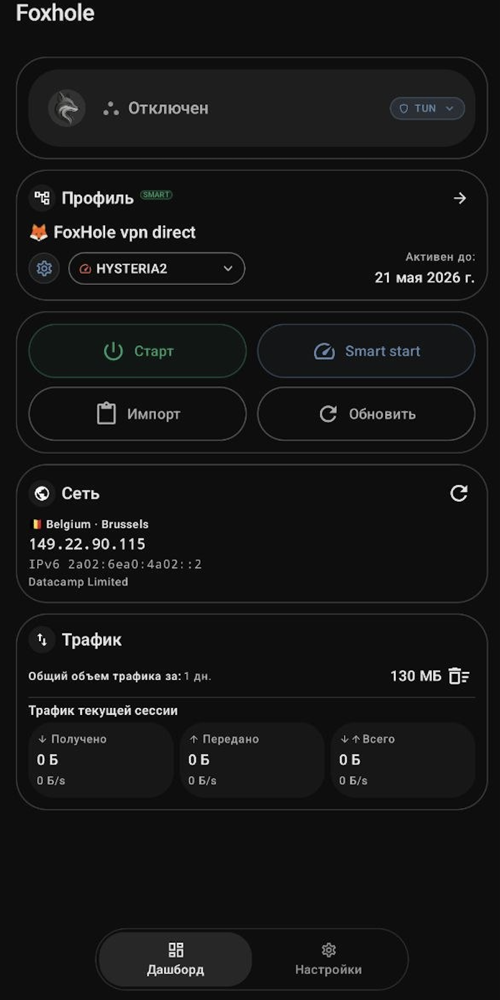
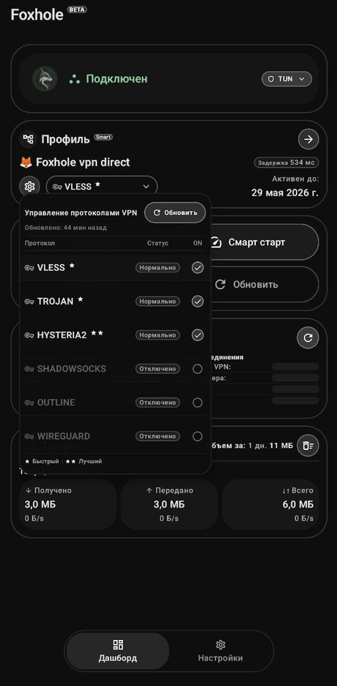
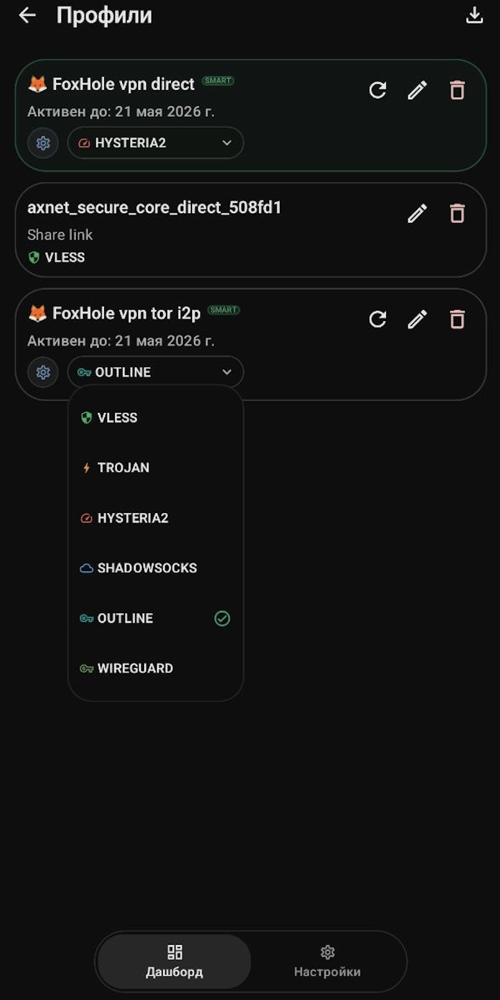

<p align="center">
  
</p>

<p align="center">
  <a href="README.md">English</a> |
  <strong>Русский</strong>
</p>

<p align="center">
  <a href="https://f-droid.org/">
    
  </a>
</p>

<p align="center">
  <strong>public beta 1.0</strong><br>
  Версии для iOS, macOS и Windows — maybe.
</p>

---

Foxhole — простой Android-клиент для подключения и управления профилями sing-box.
Поддерживает режимы Tunnel и Proxy, Split Tunnel по приложениям и сайтам, а также LAN Proxy.

Импорт профилей: файл, буфер обмена, QR-код, HTTPS-подписки (включая v2raytun-совместимые). TLS-проверка строгая по умолчанию; конфигам, которым нужен insecure TLS, требуется явное согласие для конкретного профиля.

>Без рекламы. Без аналитики. Без телеметрии.

---

<p align="center">
  
  
  
</p>

---

## Ключевые функции

- Режимы: Tunnel, Proxy
- Split Tunnel (приложения + сайты)
- LAN Proxy по Wi-Fi
- Авторизация прокси
- Правила маршрутизации по сайтам
- Импорт: файл, буфер обмена, QR, HTTPS-подписки
- Multi-protocol профили с выбором протокола
- Smart start (детерминированный автовыбор протокола)
- Локальная статистика трафика
- Отображение срока подписки
- Зашифрованное хранение профилей
- Без рекламы / аналитики / телеметрии

QUERY_ALL_PACKAGES используется только для picker приложений в Split Tunnel, чтобы Foxhole мог показать установленные приложения для include/exclude маршрутизации. Список пакетов остается локально; если Android ограничит видимость пакетов, сохраненные package id остаются в конфиге маршрутизации и показываются по имени пакета.

---

## Поддерживаемые протоколы

- VLESS
- Trojan
- Shadowsocks
- VMess
- Hysteria2
- WireGuard
- Outline

---

## Foxhole smart config

<p align="center">
  
</p>

Одна подписка может содержать один или несколько профилей.
Foxhole превращает каждую route group в отдельный профиль, а записи внутри — в варианты VPN-протоколов.

### Smart start

- Ранжирует подходящие поддерживаемые протоколы
- Сначала пробует рекомендованный протокол
- Останавливается на первом валидном успешном подключении
- Переходит к следующему кандидату только после ошибки валидации
- Пробует до трех кандидатов при Smart start
- Может проверить всех подходящих кандидатов при ручном обновлении метрик
- Исключает отключенные, просроченные, cooldown и insecure-without-consent варианты
- Запоминает успешные подключения по хешу сети
- Анализирует:
  - историю успехов/ошибок
  - last known good
  - network-scoped memory
  - состояние DNS / upstream
  - задержку
  - время подключения
  - признаки валидного трафика
  - cooldown

##### Пример:
[foxhole-smart-config.sample.txt](foxhole-sample-smart-config/foxhole-smart-config.sample.txt)

---

## Проверка подписи релиза

- Скачайте APK и `SHA256SUMS` из одного релиза
- Выполните: `sha256sum -c SHA256SUMS`

- SHA-256:
  ```
  fcbf14862040fbe26726f06f3016ec3b027d8431c76cb4c25c13c5a06837177c
  ```

- SHA-1:
  ```
  ae609bb369398071cc5ac53c9ac10f20f43c4d01
  ```


## Дисклеймер

> Разработка Android-приложений не является нашим основным направлением.
> Основная экспертиза: backend, безопасность, ML, криптография.

## Donate

- **XMR (Monero):** 
```
48yBVPTdcyJ1WoJtnKmVpEZziEsDy4HvbCW7eQDS9mfdiWPFXwZ8F5h9YZ2UTTBLxPcJgQgvth7iqLZM2yMCaQ432qaouqr
```
- **BTC (Bitcoin):**  
 ```
bc1qatnyy7jcpqrp0d3dk9rta9vqfejgh4mysd6m2f
  ```
