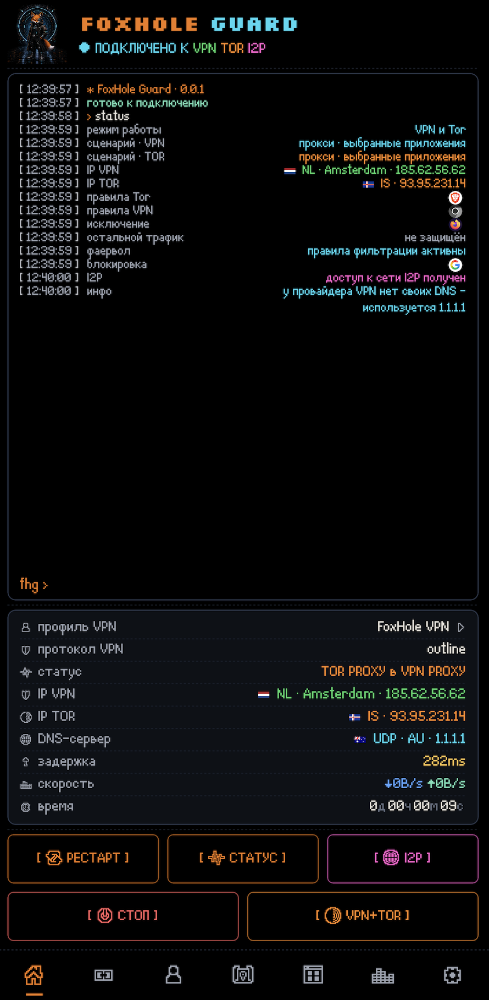
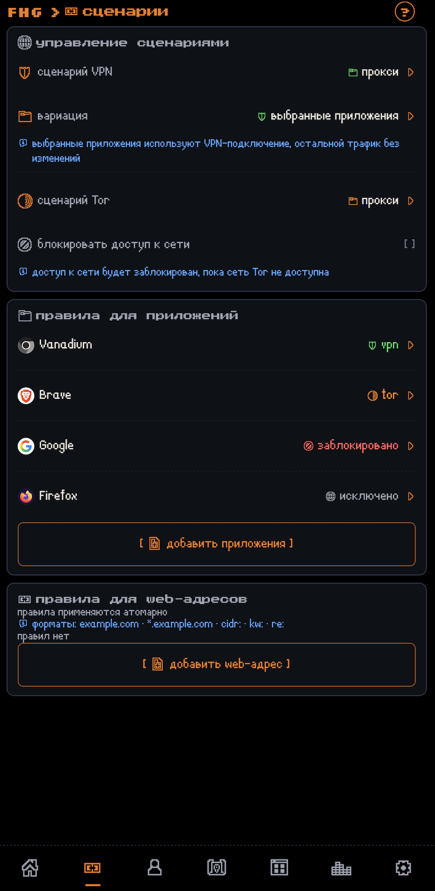
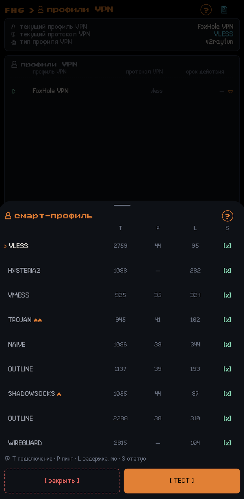
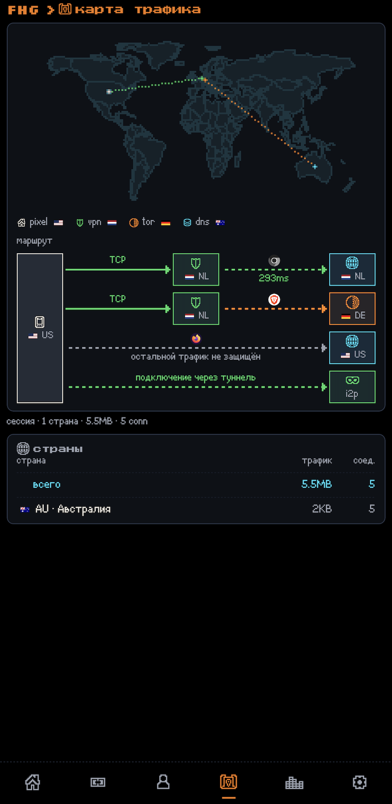
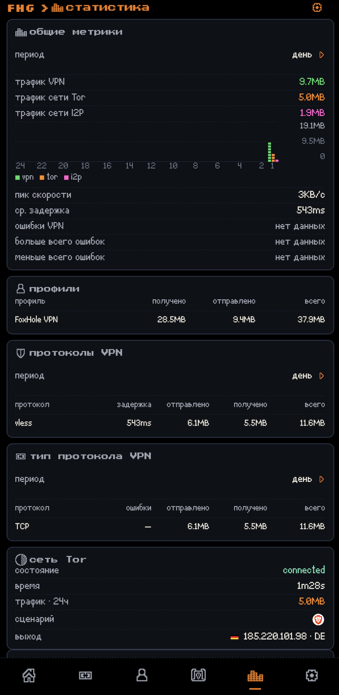
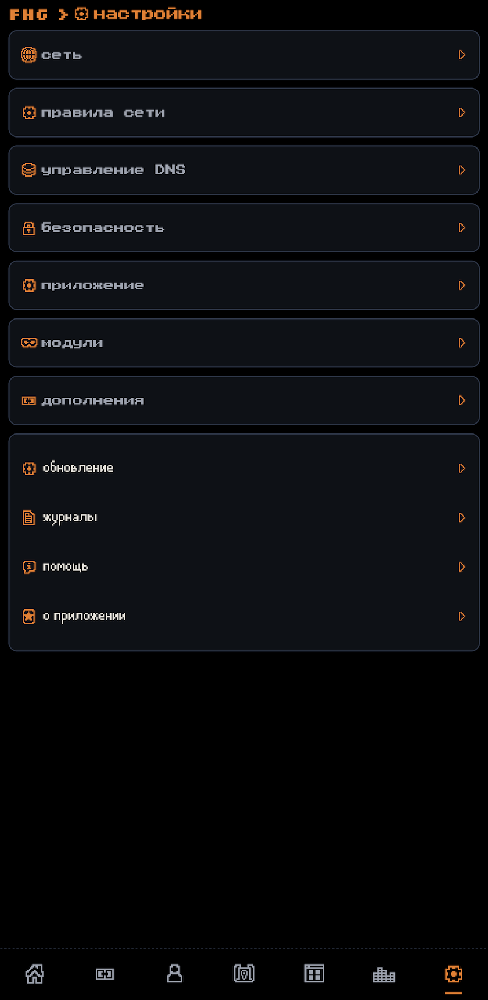

<p align="center">
    
</p>

<p align="center">
  <a href="../README.md">
    
  </a>
  <a href="README.ru.md">
    
  </a>
</p>
<p align="center">
  <a href="https://github.com/foxhole-team/foxhole-guard/releases">
    
  </a>
  <a href="https://f-droid.org/packages/com.foxhole.guard/">
    
  </a>
</p>

# FoxHole Guard


[](https://www.gnu.org/licenses/gpl-3.0.html)


**FoxHole Guard** - комплекс для защиты сети, приватности и локального контроля сетевой активности на Android.

Приложение объединяет собственное нативное сетевое ядро **FoxHole Core на Rust**, VPN, Tor, I2P, локальный фаервол, DNS-фильтрацию, контроль сетевой активности, web-приложения и прокси-сервер.

**Основная идея проекта** - одно приложение для повседневной сетевой защиты, доступа к VPN и анонимным сетям Tor и I2P, управления маршрутами трафика приложений, локального обнаружения необычной сетевой активности и несанкционированной установки приложений. FoxHole Guard ведёт журналы, в которые записываются системные события, установка и удаление приложений, а также аномалии сетевого трафика.

**FoxHole Guard** не содержит рекламы, аналитики использования или телеметрии. Списки приложений, статистика, журналы, правила маршрутизации и результаты локального анализа остаются на устройстве, если пользователь сам их не экспортирует.

> [!IMPORTANT]
> проект находится на ранней стадии **бета-тестирования** и продолжает активно дорабатываться и проходить production-гейты. **Поддержка проекта ускорит его дальнейшую разработку**. Часть кода и большая часть документации, разрабатывалась с помощью ИИ.

<p align="center">
  
  
  
  
  
  
</p>

---

## ✨ Основные возможности

- **FoxHole Core** - собственное сетевое ядро, написанное на Rust.
- **Поддержка VPN-протоколов** - VLESS, VMess, Hysteria2, WireGuard, AmneziaWG, Trojan, Shadowsocks, Naive, TUIC, AnyTLS и ShadowTLS.
- **Доступ к сети Tor** - подключение к Tor внутри TCP VPN-туннеля, маршрутизация выбранных приложений, поддержка мостов и автоматическая смена цепочки Tor по расписанию.
- **Доступ к сети I2P** - доступ к ресурсам `.i2p` через отдельный процесс `i2pd` и локальный SOCKS5-контракт с FoxHole Core.
- **Фаервол** - блокировка приложений, kill switch и карантин новых установленных приложений.
- **Управление DNS** - локальный DNS interceptor, UDP/TCP/DoT/DoH, cache и stale cache.
- **Карта трафика** - отображение текущих сетевых соединений устройства на карте мира.
- **FoxHole Sentinel** - отдельный компонент безопасности для поиска аномалий в сетевом трафике.
- **Web-приложения** - поддержка HTML5-приложений и доставка уведомлений.
- **Прокси-сервер** - прокси-сервер в локальной сети с поддержкой SOCKS5 и HTTP CONNECT с авторизацией.
- **Фоновые сервисы** - `foxhole watchdog web` и `foxhole watchdog guard` для доставки уведомлений web-приложений и фонового мониторинга событий безопасности.
- **Безопасность** - механизмы для обнаружения признаков компрометации и вмешательства: журнал установки и удаления приложений, анализ сетевых аномалий, проверка новых приложений по маркерам угроз и запрашиваемым разрешениям. Поддерживается пользовательское шифрование данных приложения.

---

## 🧭 Архитектура и модель работы

### 🔁 Схема управления приложением

```text
приложение
        ↓
режим работы  →  сценарий  →  правила маршрутизации трафика
        ↓
модули  ·  расширения  ·  фоновые сервисы
```

- **Режим работы** определяет, какое подключение к VPN и/или к сети Tor использует системный VPN-туннель Android.
- **Сценарий** определяет, как VPN и маршрут через сеть Tor применяются к устройству.
- **Правила** определяют, как приложения и web-сайты используют маршруты через VPN и сеть Tor.
- **Модули и расширения** работают рядом с любым активным режимом приложения.
- **Фоновые сервисы**, если включены, работают постоянно в пределах ограничений Android.

### 🎛️ Режимы работы

Приложение поддерживает три основных режима:

| Режим | Описание |
| --- | --- |
| **VPN** | Стандартный VPN-туннель. |
| **Tor** | Подключение к сети Tor через Arti. VPN-профиль не обязателен, требуется включённый модуль Tor. |
| **VPN и Tor** | Оба подключения работают одновременно, каждое со своим сценарием. |

### 🧩 Сценарии режимов работы

Режим работы приложения управляется сценарием. В режиме **VPN и Tor** для VPN и Tor используются независимые сценарии.

| Сценарий | Значение | Доступен для |
| --- | --- | --- |
| **Всё устройство** | Весь трафик устройства идёт в туннель. | VPN, Tor |
| **Прокси-сценарий: выбранные приложения** | Маршрутизируются только выбранные приложения. | VPN, Tor |
| **Прокси-сценарий: все, кроме выбранных** | Маршрутизируется всё, кроме выбранных приложений. | VPN |
| **Прокси-сервер** | Прокси-сервер Android через активное подключение на устройстве. | VPN |
| **Прокси-сервер в локальной сети** | Создаёт прокси-сервер в локальной сети через активное подключение на устройстве. | VPN, Tor, Mixed |

Ограничения относятся к направлению трафика всего устройства в Tor рядом с активным VPN-подключением. Если подключение к сети Tor запущено вне VPN-туннеля рядом с активным VPN-подключением, используется сценарий с выбранными приложениями. В Mixed-режиме прокси-сервера локальной сети трафик SOCKS5 маршрутизируется в VPN, а HTTP CONNECT - в Tor.

### 🔀 Правила маршрутизации трафика

Внутри активного режима и сценария действуют правила маршрутизации трафика:

- правила для приложений управляют маршрутизацией трафика между VPN и сетью Tor;
- правила **заблокировать доступ в интернет** и **исключить из DNS-фильтрации** работают постоянно при любом из трёх активных режимов и при включённом модуле фаервола;
- поддерживаются правила для web-сайтов: доменные имена, суффиксы и CIDR;
- поддерживаются отдельные DNS-политики;
- поддерживаются блокировка трафика при потере подключения, карантин новых установленных приложений и TTL-правила.

| Правило | Всё устройство | Прокси-сценарии |
| --- | --- | --- |
| приложение → VPN | не применяется | применяется |
| приложение → сеть Tor | не применяется | применяется |
| приложение → исключить | применяется | применяется |
| приложение → заблокировать | применяется | применяется |
| правила для web-адресов | применяются | применяются |

Сценарий **«Всё устройство»** игнорирует правила маршрутизации трафика, кроме правил блокировки и исключения. Если системный туннель или фаервол не работает, правило блокировки не применяется.

Все правила маршрутизации трафика применяются атомарно. Смена сценариев режимов работы приложения по умолчанию также применяется атомарно; это поведение можно отключить в настройках.

---

## 🧱 Модули

Модули настраиваются отдельно от режима работы приложения и могут работать независимо, если их функции не требуют активного сетевого маршрута.

| Модуль | Описание |
| --- | --- |
| **Карта трафика** | Показывает текущие сетевые соединения на карте мира  |
| **Статистика** | Локальный учёт по приложениям, VPN-профилям и DNS-фильтрации |
| **Журналы** | Журнал приложения, сетевой журнал и журнал безопасности |
| **Фаервол** | Блокировка приложений и карантин новых установленных приложений |
| **Tor** | Arti: TCP, `.onion`, мосты и смена цепочки Tor по расписанию |
| **I2P** | `.i2p` через отдельный процесс `i2pd` и loopback SOCKS5 |
| **FoxHole Sentinel** | Аудит приложений, IOC-матчер и журнал с проверкой хэш цепочки |
| **DNS** | DoT/DoH и локальная фильтрация |

### 🧅 Доступ к сети Tor

Доступ к сети Tor реализован через **Arti**.

Поддерживаются:

- подключение к сети Tor внутри TCP-протокола VPN;
- мосты;
- блокировка доступа к сети при потере соединения;
- смена цепочки Tor с заданным временным интервалом;
- маршрутизация выбранных приложений.

Модуль Tor входит в стандартную Android-сборку FoxHole Core.

#### 🌐 Onion service

FoxHole Core поддерживает onion service.

### 🕸️ Доступ к сети I2P

Доступ к сети I2P не реализуется внутри FoxHole Core.

Используется TCP-only loopback SOCKS5-контракт с отдельным процессом `i2pd`.

Условия I2P-маршрута проверяются fail-closed:

- перехват ссылок `.i2p` из любого приложения;
- режим ретрансляции трафика в сеть I2P;
- ограничение работы в сотовой сети;
- управление пропускной способностью.

### 🧱 Фаервол

Фаервол использует общую route policy FoxHole Core.

Поддерживаются:

- блокировка приложений;
- `Block` с приоритетом над разрешающими маршрутами;
- per-app-правила;
- сетевой карантин;
- TTL-правила;
- kill switch;
- немедленный адресный отзыв активных stream-proxy-потоков после появления запрещающего правила; L3-потоки пакетных туннелей пересматриваются после своего idle timeout;
- типизированные отказы при некорректном reload.

### 🛡️ FoxHole Sentinel

FoxHole Sentinel - модуль локального мониторинга безопасности FoxHole Guard. Его фоновая часть работает в сервисе `foxhole watchdog guard`.

FoxHole Sentinel предназначен для объединения нескольких независимых источников сигналов: индикаторов компрометации, сетевой активности, статического анализа приложений и поведенческих признаков. Результаты анализа обрабатываются локально и не отправляются разработчику.

FoxHole Sentinel не позиционируется как антивирус. Его задача - показывать пользователю наблюдаемые признаки, их источники и степень уверенности, отделяя подтверждённые IOC-совпадения от эвристических подозрений.

#### ✅ Реализовано

На текущем этапе в FoxHole Sentinel реализованы:

- **Echap Stalkerware Indicators** - локальная проверка известных индикаторов stalkerware;
- **MVT Indicators** - поддержка публичных IOC из открытых исследовательских наборов;
- **сетевой IOC-матчер** - сетевая активность приложений из живого потока событий FoxHole Core сопоставляется с известными доменами и IP-адресами; включается тумблером анализа FoxHole Sentinel;
- локальная корреляция обнаруженных IOC с приложением, которому принадлежит сетевой flow;
- интеграция с фаерволом и карантином FoxHole Guard;
- аудит событий ядра через ограниченный поток событий FoxHole Core.

Совпадение с IOC является сигналом безопасности, но само по себе не используется как безусловное доказательство заражения устройства.

FoxHole Core не хранит постоянный пользовательский Guard-журнал. Ядро передаёт приложению ограниченный поток событий, а долговременный журнал ведёт Android-приложение. Если потребитель не успевает обработать поток, audit interface явно сообщает о `dropped`.

#### 🧪 Планируется

Архитектура FoxHole Sentinel предусматривает дальнейшее расширение локального анализа, однако следующие функции **пока не реализованы и не входят в текущую версию**:

- YARA-X для локального анализа APK, DEX и native-библиотек;
- обнаружение packer-, obfuscation- и anti-analysis-признаков;
- поведенческий анализ DEX и последовательностей Android API;
- корреляция с MITRE ATT&CK Mobile;
- расширенный анализ сетевого поведения приложений;
- обнаружение beacon-подобной активности;
- анализ необычных TX/RX-паттернов;
- DGA-подобные DNS-признаки;
- per-app baseline с учётом Wi-Fi/mobile и foreground/background-состояния;
- correlation engine, объединяющий static-, IOC-, Android- и network-evidence в единый finding.

Эти функции планируются как локальные детекторы без облачной проверки и без отправки APK, списка установленных приложений или истории сетевой активности.

#### 📜 Журнал безопасности

Приложение может вести зашифрованный локальный журнал:

- установки приложений;
- обновлений;
- удалений;
- событий безопасности;
- выбранных сетевых событий.

Для контроля целостности используется хэш-цепочка.

---

## 🔌 Поддерживаемые протоколы

| Протокол / режим | Поддержка |
| --- | --- |
| **VLESS** | raw, WebSocket, HTTP Upgrade, gRPC/HTTP-2, TLS, Reality, Vision, UDP-over-stream, XUDP, packetaddr |
| **VMess** | modern AEAD (`alterId=0`), raw, WebSocket, TLS, TCP/UDP |
| **Hysteria2** | QUIC/H3, auth, Brutal, TCP/UDP, Salamander obfs, переключение порта назначения на одном защищённом локальном UDP-сокете, reconnect |
| **WireGuard** | реализация handshake Noise_IKpsk2, L3 data path, `reserved`, импорт `wg://` и `.conf` |
| **AmneziaWG** | `Jc/Jmin/Jmax/S1..S4/H1..H4`, шаблоны 2.0 `I1..I5` |
| **Trojan** | TLS, TCP и UDP framing |
| **Shadowsocks** | AEAD и AEAD-2022, TCP/UDP |
| **Outline** | вариант Shadowsocks, не отдельный протокол |
| **Naive** | нативный HTTP/2 CONNECT с protocol padding |
| **TUIC** | clean-room v5, QUIC, TLS-exporter auth, TCP/UDP, fragmentation, reconnect |
| **AnyTLS** | clean-room v2, TLS auth, padding, session reuse/multiplex, TCP и UoT v2 UDP |
| **ShadowTLS** | strict v3 / TLS 1.3, chained HMAC, обязательный inner Shadowsocks |
| **SOCKS5** | CONNECT, UDP ASSOCIATE, авторизация |
| **HTTP proxy** | HTTP CONNECT, авторизация |
| **Tor** | Arti, TCP, `.onion`, bridges |
| **I2P** | TCP-only loopback SOCKS5 adapter к отдельному `i2pd` |

### ↔️ Shadowsocks и Outline

Outline рассматривается как вариант Shadowsocks.

Поддерживаются:

- AEAD;
- AEAD-2022;
- Outline `prefix=` для совместимых AEAD-конфигураций;
- SIP003 `v2ray-plugin` в WebSocket-режиме;
- `simple-obfs` в режимах `http` и `tls`.

`v2ray-plugin` и `simple-obfs` являются транспортами, а не отдельными VPN-протоколами.

### 🚫 Не поддерживается

**ShadowsocksR (SSR)** не поддерживается как устаревшее и несовместимое с текущим набором протоколов расширение Shadowsocks.

**ShadowTLS v1** не поддерживается. Используется строгая реализация ShadowTLS v3.

---

## 🌐 DNS

### 🧭 Управление DNS

FoxHole Core содержит собственный DNS interceptor.

Поддерживаются:

- UDP DNS;
- TCP DNS;
- DoT;
- DoH;
- protected DNS sockets;
- DNS bootstrap через конкретный Android `Network`;
- cache;
- stale cache;
- fake-IP;
- route-aware DNS.

### 🧹 DNS-фильтрация

FoxHole Guard может применять локальные наборы правил для:

- рекламы;
- трекеров;
- телеметрии;
- потенциально вредоносных доменов.

Набор правил собирается из открытого фильтра AdGuard DNS. Upstream закрепляется по имени; фиды, собранные из другого источника, отклоняются.

Манифест:

```text
https://foxhole-team.github.io/foxhole-db/manifest.json
```

Загружаемые DNS-наборы являются **данными фильтрации, а не исполняемым кодом**.

Перед использованием приложение проверяет предусмотренные форматом параметры, включая подпись, размер, совместимость и SHA-256.

При ошибке проверки используется последний успешно проверенный набор правил.

---

## 🔐 TLS и защищённые сокеты

FoxHole Core использует Rust TLS-стек с проверкой сертификатов.

Поддерживаются:

- WebPKI validation;
- SNI;
- ALPN;
- SPKI SHA-256 pin;
- compatibility-режим `insecure`.

`insecure` не является безопасным значением по умолчанию и требует явного согласия пользователя.

Каждый внешний Android-сокет, создаваемый FoxHole Core, проходит:

```text
protect(fd)
    ↓
bind to Android Network
    ↓
connect / send
```

---

## 🧩 Расширения и дополнительные возможности

Расширения дополняют основные функции приложения.

| Расширение | Описание |
| --- | --- |
| **Прокси-сервер** | Открывает другим устройствам в текущей Wi-Fi-сети доступ через SOCKS5 и HTTP CONNECT с обязательной авторизацией и привязкой к подтверждённой сети. |
| **Web-приложения** | HTML5-сайты в полноэкранном фрейме; каждый работает в изолированном профиле WebView с поддержкой уведомлений. |

### 🔗 Прокси-сервер

Прокси-сервер делится активным маршрутом с другими устройствами в текущей Wi-Fi-сети.

- SOCKS5 и HTTP CONNECT;
- обязательная авторизация;
- смена сети отключает прокси-сервер и аннулирует учётные данные.

Пресеты маршрутизации: VPN, Tor, Mixed - SOCKS5 в VPN, HTTP CONNECT в Tor.

### 🖥️ Web-приложения

Для каждого web-приложения создаётся отдельный ASCII-идентификатор, который FoxHole Core использует в сетевой политике маршрутизации трафика.

- identity web-приложения: изоляция хранилища per-app; на поддерживаемых версиях WebView каждое web-приложение работает в отдельном профиле и имеет собственные cookies, хранилища и cache; при отсутствии поддержки нескольких профилей используется общий профиль WebView с браузерной изоляцией по origin;
- отдельные маршрутизируемые leases;
- сетевые правила на уровне web-приложения;
- уведомления, привязанные к идентификатору канонического origin;
- отзыв предоставленного lease.

Данные web-приложения — cookies, хранилища и cache — можно очистить отдельно для каждого добавленного web-приложения. Полное удаление web-приложения также удаляет его данные.

#### 🔔 Фоновый сервис web-приложений - `foxhole watchdog web`

Уведомления web-приложений доставляет отдельный фоновый сервис.

**Модель опроса.** Сервис опрашивает включённые web-приложения по расписанию через скрытый WebView: устанавливает на страницу JS-shim и читает счётчик сайта, если он есть, иначе - `(N)` в заголовке вкладки. Доставка периодическая, а не мгновенная; интервал задаётся в настройках. Ритм задают ticker внутри процесса приложения и проход WorkManager раз в 15 минут на случай завершения процесса. Одновременные проходы объединяются; изображения во время опроса не загружаются.

**Условия опроса.** Приложение не опрашивается, если:

- его маршрут недоступен: маршрут VPN требует активного VPN-подключения и доступного локального proxy-моста; WireGuard и AmneziaWG не используются для такого опроса, поскольку локальный proxy-мост для них не создаётся; маршрут Tor требует активной Tor-цепи; маршрут I2P — активного подключения к сети I2P; маршрут `BLOCK` всегда запрещает опрос;
- proxy override WebView не установлен: переопределение действует на весь процесс и проверяется fail-closed; принимается только loopback-host с доступным портом и обоими значениями учётных данных, иначе переопределение не применяется.

**После опроса.** Переопределение снимается, и снятие проверяется. Сеть service worker'ов блокируется до переключения маршрута, чтобы фоновый worker страницы не вышел в сеть мимо нового переопределения. Открытый на переднем плане фрейм забирает переопределение эксклюзивно: пока он им владеет, фоновые проходы не начинаются, а при отказе во взятии фрейм не открывается. Фрейм никогда не работает в обход маршрута.

## ⚙️ Фоновые сервисы

FoxHole Guard использует два независимых фоновых сервиса.

| Сервис | Функция |
| --- | --- |
| **`foxhole watchdog web`** | Проверка и доставка уведомлений для добавленных web-приложений. |
| **`foxhole watchdog guard`** | Мониторинг событий, запись установки и удаления приложений, а также аномалий сетевого трафика в защищённый журнал. |

В усиленном режиме `foxhole watchdog guard` создаёт foreground service, чтобы оставаться в памяти, когда нет активного сетевого соединения, и останавливается после обнаружения активного подключения. Экономный режим использует периодический опрос WorkManager.

---

## 🗃️ FoxHole DB и наборы данных

[](https://github.com/foxhole-team/foxhole-db)

FoxHole DB содержит четыре независимых набора данных, которые приложение загружает в зависимости от включённых функций.

| Набор данных | Артефакт | Формат | Источник | Лицензия | Версия |
| --- | --- | --- | --- | --- | --- |
| **DNS - списки фильтрации** | `adguard-dns-filter.fhds` | `foxhole-dns-fst-v1` | [AdGuard DNS filter](https://github.com/AdguardTeam/AdGuardSDNSFilter) | GPL-3.0 | Upstream-коммит пинится на каждую сборку. |
| **Tor - зеркало builtin-мостов** | `bridges.json` | `tor-bridges-json` | [Builtin-мосты Tor Project (Moat)](https://bridges.torproject.org/moat/circumvention/builtin) | публичные данные обхода цензуры | Метка `generated_at`; артефакт байтово воспроизводим из неизменённого upstream. |
| **FoxHole Sentinel - списки безопасности (threat intelligence)** | `threat-intel.json` | `sentinel-threat-intel-json`, документ `schema: 3` | [AssoEchap/stalkerware-indicators](https://github.com/AssoEchap/stalkerware-indicators) | CC-BY-4.0 | Upstream-коммит пинится на каждую сборку и фиксируется в `threat-intel-source-info.json`. |
| **геобаза данных - IP → страна** | `dbip-country-ipv4.csv`, `dbip-country-ipv6.csv` | `dbip-country-csv` | [DB-IP Lite через sapics/ip-location-db](https://github.com/sapics/ip-location-db) (`dbip-country`) | CC-BY-4.0 | Upstream-`version` из `package.json` датасета переносится в манифест. |

---

## 🔒 Разрешения и приватность

- `INTERNET` - VPN, proxy, Tor, I2P, DNS, web-приложения, подписки и обновляемые сетевые данные.
- `ACCESS_NETWORK_STATE` / `ACCESS_WIFI_STATE` - состояние сети, сетевые правила и прокси-сервер.
- `FOREGROUND_SERVICE` и соответствующие foreground-service permissions - длительная работа пользовательских сетевых режимов с видимым уведомлением.
- `QUERY_ALL_PACKAGES` - список приложений для split routing, firewall, quarantine, DNS exclusions и локального аудита.
- `PACKAGE_USAGE_STATS` - только для включённых пользователем функций локальной статистики и анализа, которым нужен соответствующий системный доступ Android.
- `CAMERA` - QR-импорт.
- `POST_NOTIFICATIONS` - сетевые службы, FoxHole Sentinel и уведомления web-приложений.
- `RECEIVE_BOOT_COMPLETED` - восстановление выбранного режима после перезагрузки.
- `WAKE_LOCK` - поддержание сетевых сессий там, где это необходимо.

**На устройстве остаются:**

- список установленных приложений;
- локальная статистика;
- соединения и журналы;
- результаты FoxHole Sentinel;
- история автоподключений;
- DNS-исключения;
- firewall policy;
- route policy;
- локальные данные web-приложений;
- настройки модулей и дополнений;
- Vault metadata.

FoxHole Guard не отправляет эти данные разработчику.

### 🌍 Сетевые запросы

FoxHole Guard выполняет сетевые запросы только для включённых или инициированных пользователем функций:

- VPN;
- Tor;
- I2P;
- обновления HTTPS-подписок;
- connectivity checks;
- пользовательский DNS;
- GeoIP/DNS/Tor bridge updates;
- web-приложения;
- доставка событий для включённых web-приложений.

---

## 🤖 Android / Native ABI

FoxHole Core подключается к Android через versioned C/JNI ABI.

Capabilities API сообщает приложению фактически скомпилированные протоколы и возможности ядра.

APK публичной беты содержит один проверенный на устройстве ABI: `arm64-v8a`.

`armeabi-v7a` и `x86_64` остаются доступными целями для разработки, но не
публикуются до прохождения полной runtime-матрицы на реальных устройствах.

Нативные библиотеки собираются из закреплённого Rust/NDK toolchain и проходят ELF-гейты.

---

## 🔏 Проверка релиза

Для APK из официального релиза рекомендуется проверять контрольную сумму и сертификат подписи.

```bash
sha256sum -c SHA256SUMS
```

```bash
apksigner verify --print-certs FoxHole-<tag>-<abi>-release.apk
```

Ожидаемый SHA-256-отпечаток сертификата:

```text
e59de2486084c38f3c77e9df0eb5eff9a4559f3c68024f1208e0e9c04b0df665
```

Ожидаемый SHA-1-отпечаток:

```text
9e00dc6b54461a4647cb11133b394cdfc986646d
```

---

## 🔗 Связанные проекты

[](https://github.com/foxhole-team/foxhole-core)
[](https://github.com/foxhole-team/foxhole-core/releases)

[](https://github.com/foxhole-team/foxhole-db)
[](https://github.com/foxhole-team/foxhole-db/releases)

---

## 📄 Лицензии

FoxHole Guard и FoxHole Core распространяются по лицензии:

**GNU General Public License v3.0 or later (`GPL-3.0-or-later`)**

Copyright (C) 2026 FOXHOLE TEAM.

Лицензии сторонних зависимостей перечислены в:

- `THIRD_PARTY_NOTICES.md`;
- SBOM проекта (`*.cdx.json`).

Граф зависимостей и лицензий проверяется в CI.

---

## ❤️ Поддержать

**XMR (Monero):**

```text
48yBVPTdcyJ1WoJtnKmVpEZziEsDy4HvbCW7eQDS9mfdiWPFXwZ8F5h9YZ2UTTBLxPcJgQgvth7iqLZM2yMCaQ432qaouqr
```

**BTC (Bitcoin):**

```text
bc1qatnyy7jcpqrp0d3dk9rta9vqfejgh4mysd6m2f
```

**ETH (Ethereum):**

```text
0xDEBA357Cc8f5E865ea7FFa98E138C8241A16A465
```

---

## ⚠️ Дисклеймер

> Разработка Android-приложений не является нашим основным направлением.  
> Основная специализация - backend, безопасность, машинное обучение и криптография.

- Tor является товарным знаком The Tor Project. FoxHole Guard не является продуктом The Tor Project, не одобрен, не спонсируется и не аффилирован с The Tor Project.
- FoxHole Guard не является продуктом AdGuard и не аффилирован с AdGuard Software Ltd.
- FoxHole Guard не является официальным продуктом I2P или PurpleI2P.
